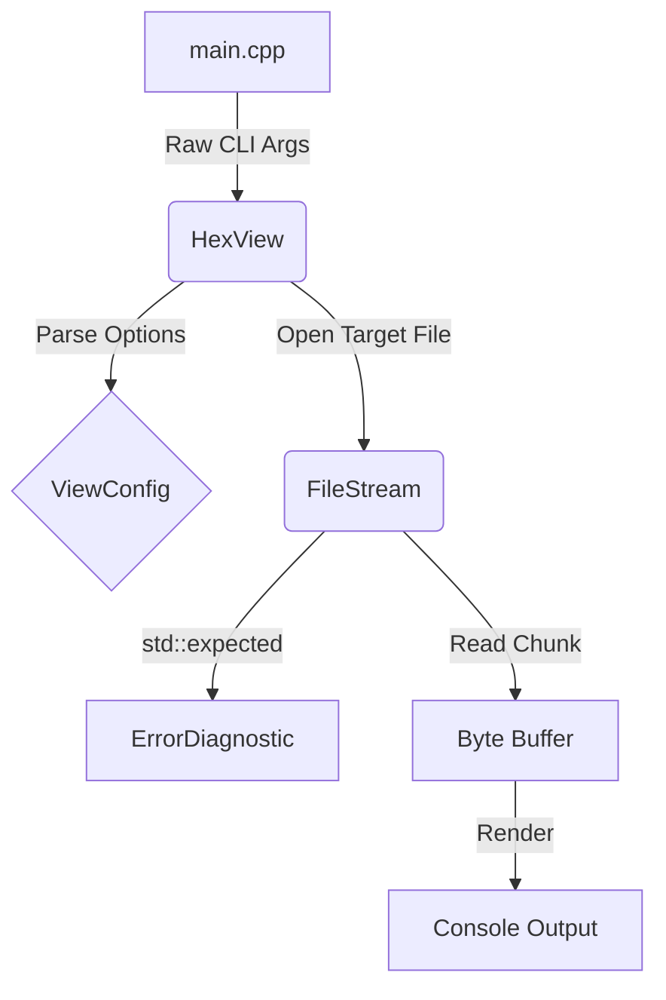

# HexView Architecture

HexView is built with modularity, safety, and modern C++23 paradigms in mind. The core design completely decouples the file I/O layer from the command-line rendering logic.

## High-Level Flow

## Core Components

### 1. `FileStream`
The `FileStream` class is responsible for all OS-level file operations. It safely wraps `std::ifstream` and utilizes C++17 `std::filesystem` to perform canonical path resolution. 
- **Exception Safety**: Instead of throwing exceptions, `FileStream` captures filesystem errors (`std::error_code`) and returns them as `std::unexpected`.
- **Chunking**: The `getChunk()` method ensures that memory usage remains flat regardless of file size, yielding bytes lazily.

### 2. `HexView`
The primary controller class. It manages state via the `ViewConfig` bitmask enum and executes the actual print loop.
- Uses `std::from_chars` alongside SWAR (SIMD Within A Register) logic to rapidly and safely parse numeric arguments from the CLI without throwing exceptions.

### 3. `ErrorDiagnostic`
An evolution of a simple enum-based error system, `ErrorDiagnostic` encapsulates underlying `Error` codes along with dynamic string tracing.
- If a low-level OS error occurs (e.g., "Permission Denied"), `ErrorDiagnostic` carries this dynamic payload all the way up to the CLI renderer without risking `std::bad_alloc` crashes.
